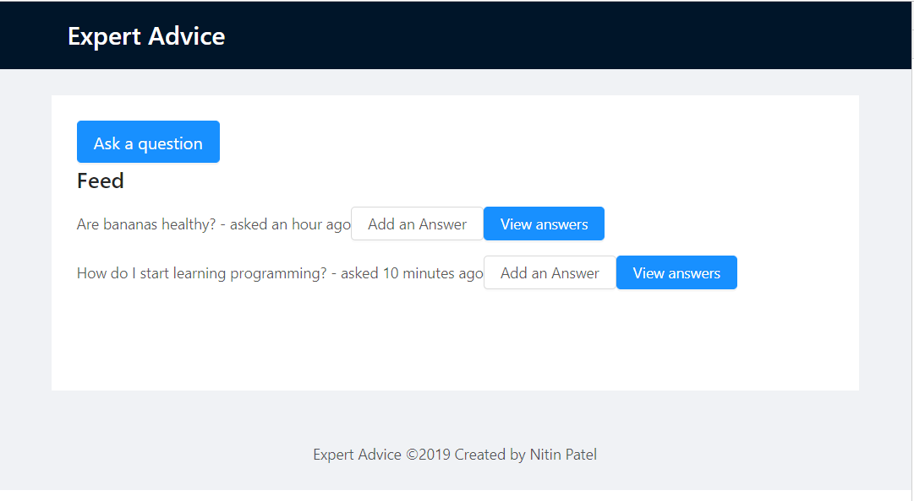

# expert-advice

A question & answer platform built on arweave blockchain. This app was built in a hurry for [Open Knowledge Platforms](https://gitcoin.co/issue/ArweaveTeam/Bounties/3/3163) bounty.

## Preview

## Run it locally.

This app was made using create-react-app. To run it locally, run `npm install` then `npm start` after cloning into the repo.
